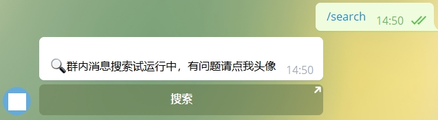
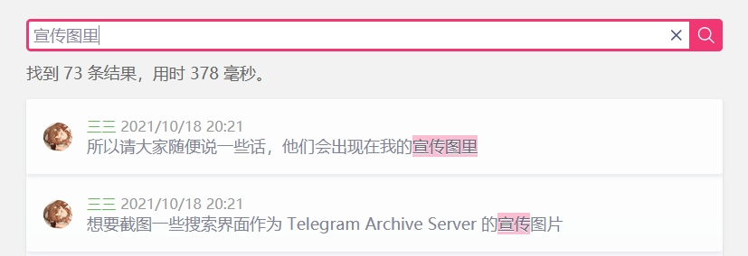
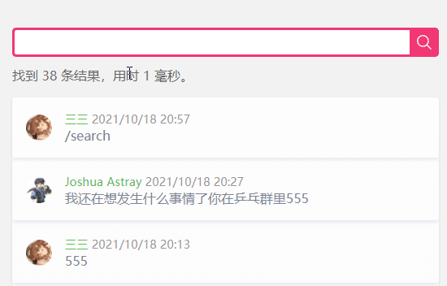
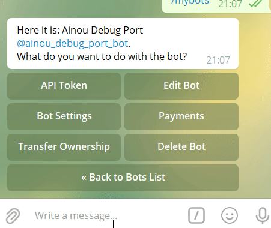

# Telegram Archive Server

[](https://quay.io/repository/oott123/telegram-archive-server) 

一个适合 CJK 环境的，Telegram 群聊搜索和归档机器人。

## 功能概览

- 支持群成员鉴权，仅群友可以搜索
- 支持导入历史聊天记录，自动去重
- 使用 MeiliSearch 对中文进行搜索，索引效果好
- 有简单的网页界面，可以显示头像
- 搜索结果可以跳转打开聊天界面

## 展示

### 聊天鉴权



点击【搜索】按钮即可自动鉴权打开搜索界面。

### 搜索界面



点击时间链接即可跳转聊天界面。



## 部署

### 准备

你需要：

- 一个 Bot 帐号，事先获取它的 token；
- 一个公网可及的 https 服务器（当然 http 的也凑合用）
- 一个**超级群**，目前只支持超级群
- 一个 MeiliSearch 实例，配不配置 key 都行
- 一个 Redis 实例，没有也行
- 一个 Docker 环境

### 配置

下载 [`.env.example`](./.env.example) 文件，参考内部注释，进行响应配置。

你可以将它保存为 `.env` ，或是作为环境变量配置。

### 运行

```bash
docker run -d --restart=always --env-file=.env quay.io/oott123/telegram-archive-server
```

当然，也可以使用 Kubernetes 或者 docker-compose 运行。

### 使用

在群里发送 `/search`。Bot 可能会提示你设置 Domain，按提示设置即可。



## 开发

```bash
DEBUG=app:*,grammy* yarn start:debug
```
